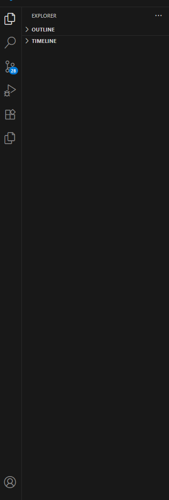

# Briefly ✍️ – Reformulateur IA de contenus

**Briefly** est une application de reformulation de contenus professionnels (emails, textes, messages Slack...) construite avec :

- [Next.js App Router](https://nextjs.org/docs/app)
- [TypeScript](https://www.typescriptlang.org/)
- [NextAuth.js](https://next-auth.js.org/) pour l'authentification GitHub/Google
- [Prisma](https://www.prisma.io/) + SQLite (local dev)
- [shadcn/ui](https://ui.shadcn.com/) pour les composants UI
- Middleware `next-auth/jwt` pour la protection des routes (`/dashboard`)
- Et bientôt : intégration OpenAI et historique en base

---



## 🚀 Lancer le projet

```bash
npm install
npm run dev
```
